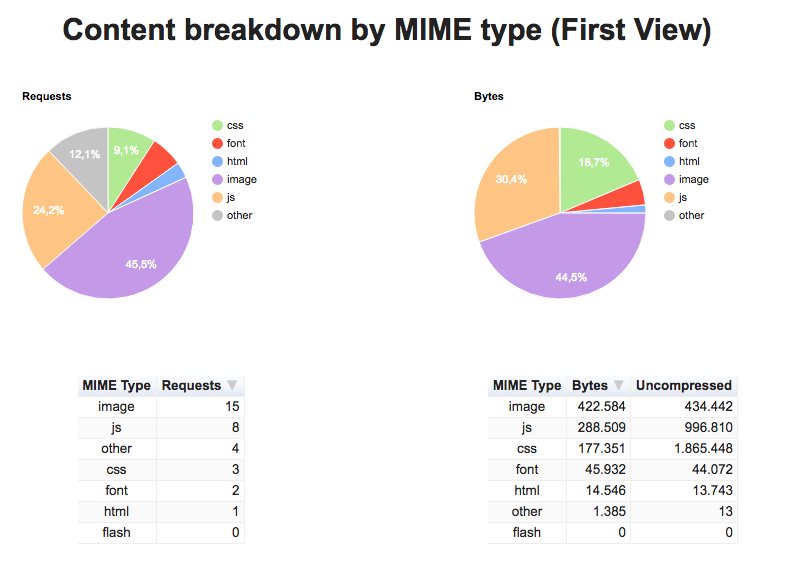
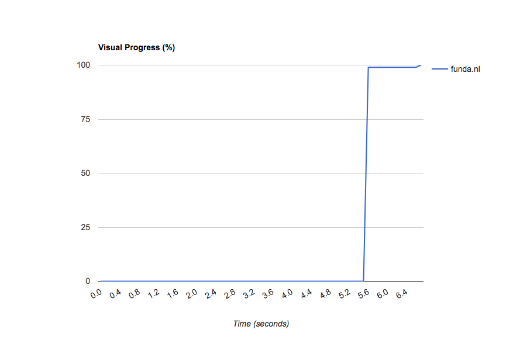
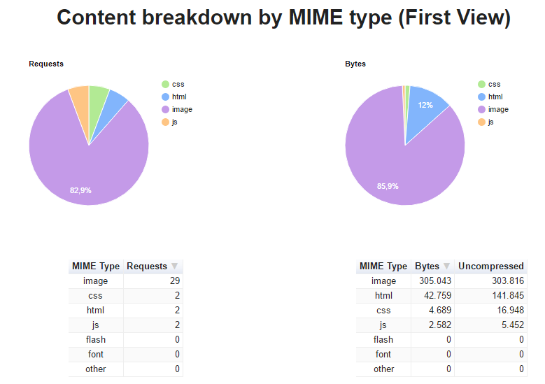
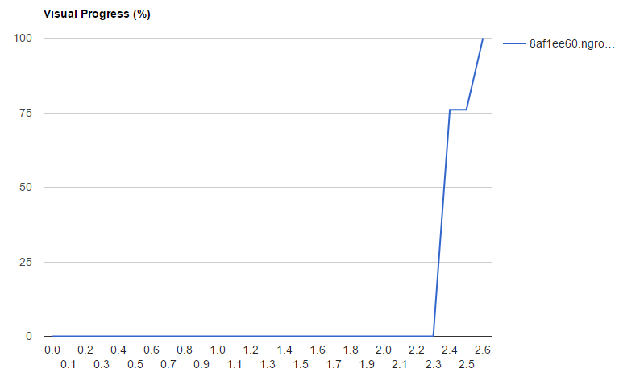
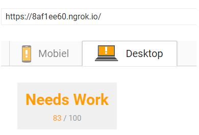
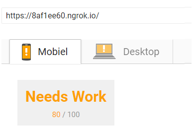

# Funda serverside

Funda serverside is an serverside application that runs on Node.js + Express. This project is build to illustrate a few performance patterns to optimize the speed of Funda. Funda serverside is based on the existing [Funda site](www.funda.nl).

## What does it do
Funda serverside allows users to search houses and get information about houses in the Netherlands are registered on Funda.  

## How to install
First clone this repo with:
```txt
$ git clone https://github.com/eltongonc/funda_serverside.git
```
Install the dependencies:
```txt
$ npm install
```

An API-key is required to run this project. Contact Funda for a key. When you have a key place it the `.env` file in this format:
```txt
KEY=1234567890qwertyuiopasdfghjklzxcvbnm1234567890qwer
```
the `.env` file should be placed in the root folder:
```
funda_serverside/
├── public/
├── routes/
├── views/
├── .env
├── package.json
├── app.js
└── README.md
```

then run
```
$ npm start
```
 this should run a local server on `localhost:3000`.


For a live development server, keep the local server terminal open, open another one and run:
 ```
 $ npm run live
 ```
this should give you a http and https link in this format: `http://xxxxxxxx.ngrok.io` and `https://xxxxxxxx.ngrok.io`.
Copy on of these links and paste it in your browser.


## Screenshots
##### Full page


##### Auto suggest


## Performance
In order to compare the performance a few features were build. Here is a overview of those features.
### Funda serverside: before
This is an analysis of [Funda homepage](www.funda.nl) version in it's current state for common internet connection:

| Connection | DOM Content Loaded | Fully loaded  |
|------------|:------------------:|:-------------:|
| GPRS       | 2.1 minutes        | 2.6 minutes   |
| Good 2G    | 16.84 seconds      | 20.88 seconds |
| Good 3G    | 15.29 seconds      | 17.23 seconds |
| Regular 4G | 6.05 seconds       | 9.89  seconds |
| Wifi       | 6.48 seconds       | 8.88  seconds |


#### Overview [Webpagetest](https://www.webpagetest.org)
##### Content loaded


##### Page load


#### Overview [PageSpeed insights](https://developers.google.com/speed/pagespeed/insights/?hl=nl)

##### Score - desktop

##### Score - mobile


### Conclusion
After analyzing [Funda](www.funda.nl) I noticed that the fully loaded time could be better. Also the mobile version doesn't score high enough.

## To-do
- Server Gzip
- CSS Optimization
- Image compression
- Service worker
- Javascript compression


### Optimizations
A series of tests were done with chromes internet connection throttling. These internet speed-tests emulate how people with a slow connection experience a website. The connections exist of GPRS, Good 2G, Good 3G, Regular 4G and Wifi with disabled cache.

#### Node.js + Express.js
This step was mainly rebuilding the homepage of Funda to illustrate how the webapp could be optimised with a Node.js server. Serving html files from the server can boost the overall speed, but because this is a rebuild it wouldn't be fair to compare it to the previous table. The next table will

##### Results

| connection | DOM Content Loaded | Fully loaded  |
|------------|:------------------:|:-------------:|
| GPRS       | 2.1 minutes        | 2.6 minutes   |
| Good 2G    | 16.84 seconds      | 20.88 seconds |
| Good 3G    | 15.29 seconds      | 17.23 seconds |
| Regular 4G | 6.05 seconds       | 9.89  seconds |
| Wifi       | 6.48 seconds       | 8.88  seconds |

#### GZIP
To GZIP the files I used a module called compression.
```js
// compression
app.use(compression({
  threshhold: 0,
  filter:  true
}));
```

#### CSS Optimization
To increase the overall speed I generated some critical-css. The criticalCSS is the style that the site needs above the page fold.

##### Penthouse module
The `criticalCSS-generator.js` file loops through all files in the `/public/css/` folder and checks for css that can be applied on the viewport with the `penthouse node module`. It then continues to generate a criticalCSS file.

##### criticalCSS-generator.js
```js
var penthouse = require("penthouse")
,   fs = require('fs');

penthouse(config, function(err, criticalCss) {
    if (err) throw err;
    fs.appendFileSync(path.resolve(dirname+"../criticalCSS/critical.css"), criticalCss);
});
```

##### CriticalCSS loader: loadCSS
To use the criticalCSS I used a module called loadCSS. This functions makes sure the CSS loads after the page is done rendering the HTML content.
```HTML
    <style>
        /*Inline criticalCSS style*/
    </style>

    <!-- Async CSS -->
    <script>
        loadCSS("/path/to/style.css")
    </script>

    <!-- Fallback if the browser does not support Javascript -->
    <noscript>
            <link rel="stylesheet" href="/css/style.css">
    </noscript>
```


#### Images Optimization
I did not find a way to optimize the images, because images are stored on a externa; server.


#### Javascript Optimization
- All javascript are inline and minified.
- Put all javascript in the header for `non-blocking` javascript.
- Added a `defer` attribute on the script tags. This makes sure that javascript will load after the page is done loading.


### Funda serverside: After
Here are the results of the changes made to Funda serverside:

| connection | DOM Content Loaded | Fully loaded  |
|------------|:------------------:|:-------------:|
| GPRS       | 3.02 seconds       | 56.88 seconds |
| Good 2G    | 1.55 seconds       | 7.33 seconds  |
| Good 3G    | 1.24 seconds       | 3.23 seconds  |
| Regular 4G | 1.47 seconds       | 2.83 seconds  |
| Wifi       | 1.26 seconds       | 2.26 seconds  |

#### Overview [Webpagetest](https://www.webpagetest.org)


##### Content loaded



##### Page load


#### Overview [Webpagetest](https://www.webpagetest.org)

##### Score - desktop

##### Score - mobile



#### Conclusion
The site is much faster after applying the changes. Rendering the files on the server will give it a boost in performance. Loading the page async helps the DOM content te be loaded much faster. I didn't succeed in making the images smaller, but I managed to score better for mobile.

## Contributing to the app
Because this was a three week project there is still a lot that can to be implemented. Below is a list of features already in the app and a wishlist of features.

### Features
- Get a list of houses based on a search query.
- View and get information about a house.
- Lazy loading
- Infinite scroll
- Autosuggest locations


### Wishlist
- Search wizzard(in progress)
- Check if userquery already exist. No extra API calls if the search is already present.
- Pretty urls
- Lazy loading
- Use the server worker for hybrid functionalities


## How to contribute
You can help improve this project by sharing your expertise and tips, as well as learn from others. Contributions of all kinds are welcome: reporting issues, updating documentation, fixing bugs, building examples, sharing projects, and any other tips that may me improve my code.


## Example
Because this project requires a key I shall not make it live.


### Built With
- Node.js with an Express.js framework.
- Handlebars - Serverside templating.
- CSS for the styling.


### Author
Elton Gonçalves Gomes - checkout more of my work on [github](https://github.com/eltongonc)
